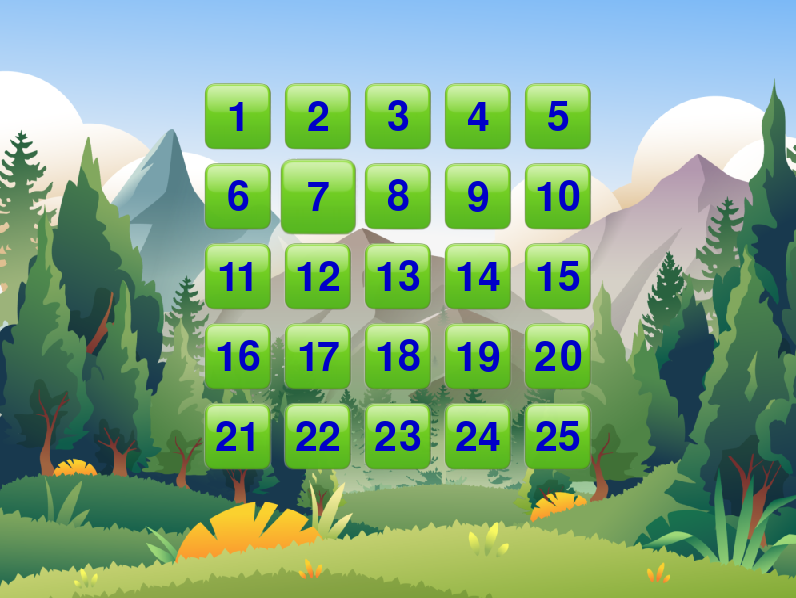
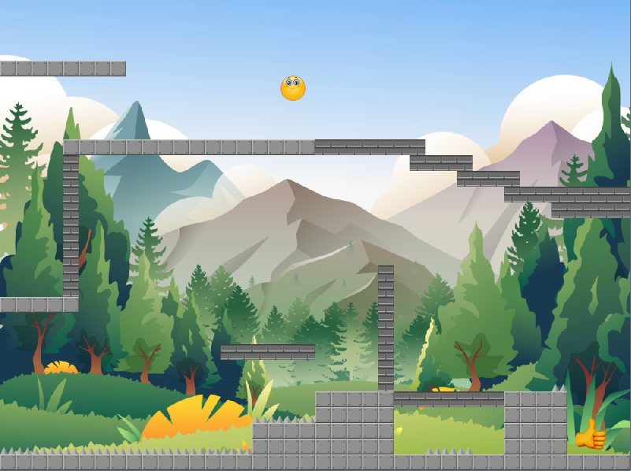
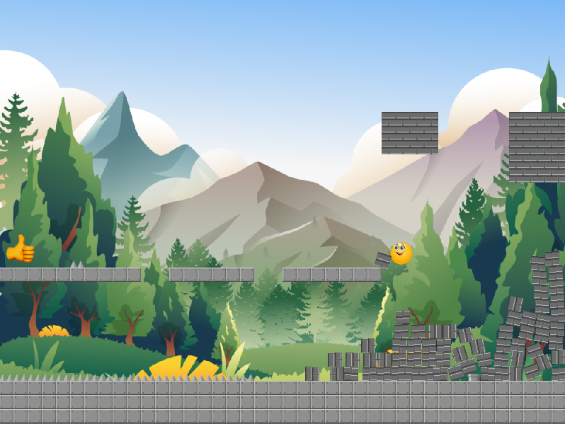
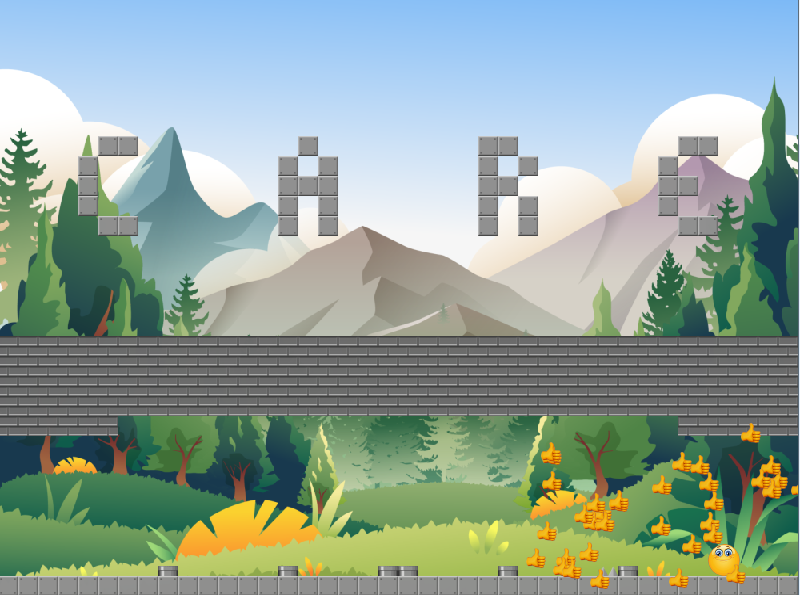
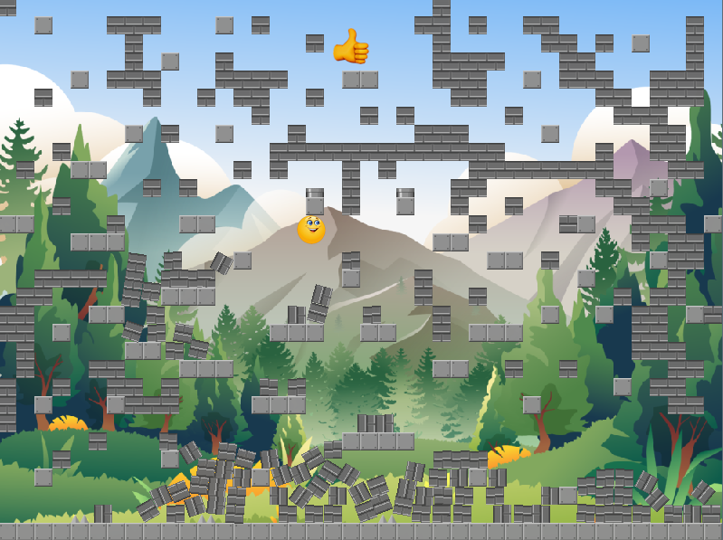
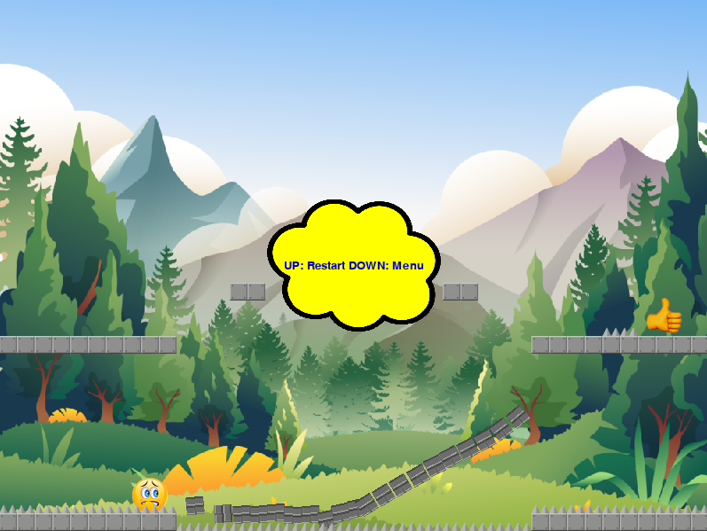

## Smiley 😃

### About
A small platformer game.

### Screenshots
  
  

### Libraries
**pygame** - a free and open-source cross-platform library for the development of multimedia applications like video games using Python

**pymunk** - an easy-to-use pythonic 2D physics library that can be used whenever you need 2D rigid body physics from Python

### Levels
Levels can be created in free level editor [Tiled.](https://www.mapeditor.org/)

