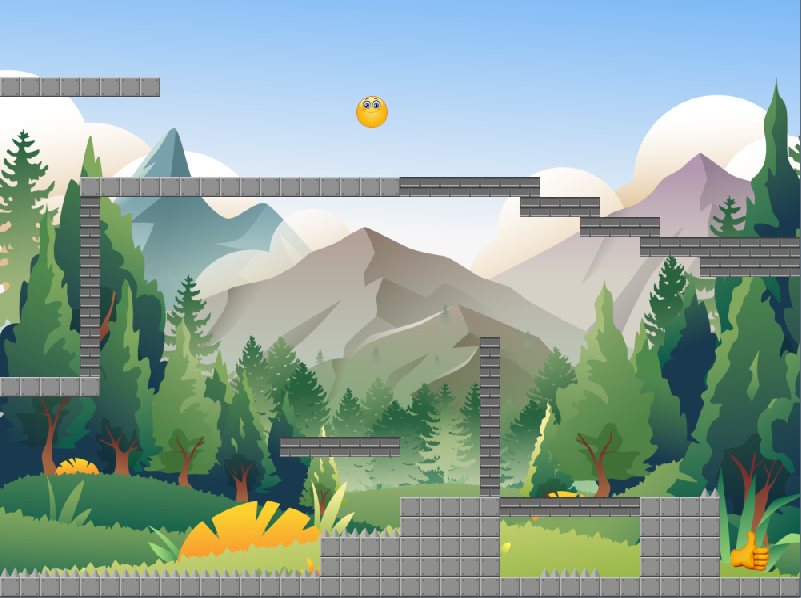

## Smiley
A small platformer game (written in Python).

On each level, help the Smiley 😃 to reach the Like 👍. Avoid spikes and dynamic bricks (from falling and destroying the level architecture).
## Screenshots
  
  
## Libraries
**Pygame** - a free and open-source cross-platform library for the development of multimedia applications like video games using Python.

**Pymunk** - an easy-to-use pythonic 2D physics library that can be used whenever you need 2D rigid body physics from Python.
## External resources
Levels can be created and edited in [Tiled](https://www.mapeditor.org/) - free and open source, easy to use, and flexible level editor.
## Controls
➡️ - Move right

⬅️ - Move left

⬆️ - Jump

⬇️ - Fix position

F11 - Toggle fullscreen

## Version
As of 03.08.25 - Some test levels made.
